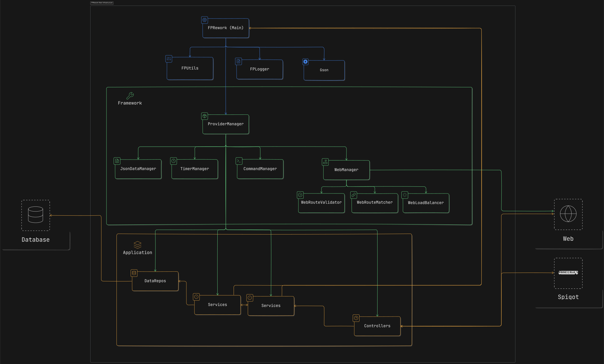

## FPRework-Next

The next rework of the minecraft server FantasyPixel.

### Setup

1. Install the [spigot build-tools](https://hub.spigotmc.org/jenkins/job/BuildTools/lastSuccessfulBuild/artifact/target/BuildTools.jar).
2. Run the command ```java -jar BuildTools.jar --rev 1.19.2``` to start the building process.
   ```1.19.2``` represents the minecraft version, the plugin currently runs on 1.19.2.
3. Copy the generated ```spigot-1.19.2.jar``` to the [server directory](/server/).
4. Start the server with the [start script](/server/start.bat).
5. Build the plugin with the maven goal ```package```.

### Infrastructure

(Might be out of date, the live version can be found at [eraser.io](https://app.eraser.io/workspace/i0w4LQC7ZDzmc5JVdRBQ)).


